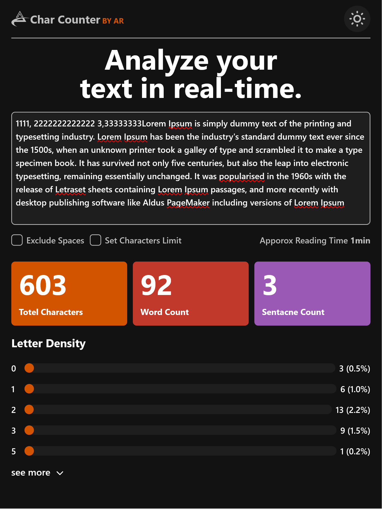

# Letter Counter WebApp

A real-time text analysis tool **inspired from frontendmentor.io** built with **React** and **Tailwind CSS** to help you count characters, words, sentences, and analyze letter density. Easily toggle features like space exclusion, letter limits, and reading time estimation — with full support for light and dark modes.

## 🚀 Live Demo

[View Live App](https://anoop-rajoriya.github.io/LetterCounter-WebApp/)

## 📸 Screenshots

- **Desktop**
  

  

- **Tablet**
  

  

- **Mobile**
  

  

## ✨ Features

- **Character & Word Count:** Count characters (with or without spaces) and words in real-time.
- **Sentence Count:** Automatically count the number of sentences.
- **Reading Time Estimator:** Get an estimated reading time based on word count.
- **Letter Density Analysis:** See letter frequency with priority sorting (caps, lowercase, numbers, symbols).
- **Toggle Features:**
  - Exclude spaces from character count.
  - Set letter limits with a warning.
  - View top letter density or expand to see all.
- **Responsive Design:** Fully optimized for desktop, tablet, and mobile screens.
- **Dark/Light Mode Support:** Seamlessly switch between themes.

## 🛠️ Tech Stack

- **Frontend:** React, TailwindCSS
- **Bundler:** Vite

## 📂 Project Setup

1. Clone the repository:

```bash
 git clone https://github.com/Anoop-Rajoriya/LetterCounter-WebApp.git
```

2. Navigate to the project folder:

```bash
cd LetterCounter-WebApp
```

3. Install dependencies:

```bash
npm install
```

4. Start the development server:

```bash
npm run dev
```

5. Open the app in your browser:

```
http://localhost:5173
```

## 👨‍💻 Author

- **Anoop Rajoriya** — [GitHub](https://github.com/Anoop-Rajoriya)

## 📜 License

This project is licensed under the MIT License — feel free to use and modify it as you like!
